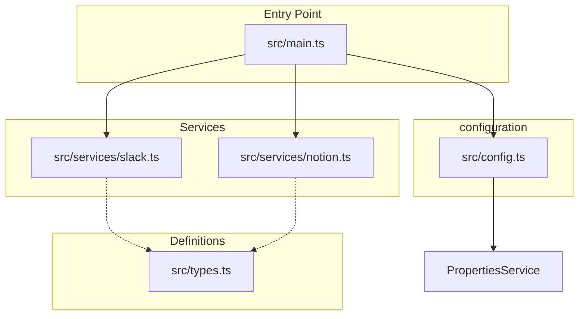

# プロジェクト構成とアーキテクチャ

このプロジェクトは、Google Apps Script (GAS) の環境と TypeScript での保守性を両立させるために以下の構成でリファクタリングされました。

## ファイル構成

| ファイル/ディレクトリ | 役割 |
| :--- | :--- |
| `src/main.ts` | エントリーポイント。Webhookの受信 (`doPost`) とフロー制御を担当。 |
| `src/config.ts` | 環境変数 (`ScriptProperties`) や定数の一元管理を担当。 |
| `src/services/slack.ts` | Slack API との通信（情報取得・リアクション追加）を担当。 |
| `src/services/notion.ts` | Notion API との通信（ページ追加）を担当。 |
| `src/types.ts` | 各 API のデータ構造を定義する TypeScript インターフェース。 |

## アーキテクチャ図

各コンポーネントの関係性は以下の通りです。GASのグローバルスコープ要件を満たすため、`import/export` は使用せず、プロジェクト全体で一つのスコープを共有しています。

## 実装上の注意 (GAS 環境への対応)

- **グローバルスコープ**: GAS では `import`/`export` が直接解釈されないため、TypeScript のコンパイル設定と記述により、すべてのファイルがグローバルスコープを共有するように構成されています。
- **命名の衝突**: クラス名や関数名がグローバルで重複しないよう、サービスごとにクラス (`SlackService`, `NotionService`, `Config`) にまとめています。
